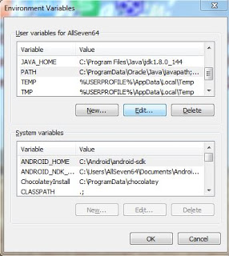

# Apa Saja yang Dibutuhkan Untuk Belajar Flutter ?

Ada beberapa peralatan yang harus kita install untuk memulai belajar dan membuat aplikasi dengan Flutter :

1. Java Development Kit (JDK)
2. Android Studio
3. Android SDK
4. Flutter SDK
5. Teks Editor (atau bisa juga pakai Android Studio).

Agar dapat menginstal dan menjalankan Flutter pada Windows, perlu diperhatikan spesifikasi laptop/PC dengan memenuhi persyaratan minimum seperti berikut:
1. Sistem Operasi : Windows 7 SP1 atau yang terbaru (64-bit)
2. Ruang Penyimpanan : 400MB (Tidak termasuk ruang penyimpanan untuk IDE/tools)

## 1. Install Flutter SDK
Langkah-langkah mendapatkan Flutter SDK:
1. Download file instalasi dengan versi terbaru dari Flutter SDK. Silahkan buka link ini untuk mendownload Flutter SDK <a href="https://flutter.io/get-started/install/">https://flutter.io/get-started/install/</a>. Flutter SDK tersedia dalam tiga platform: Windows, Linux dan MacOs. Pilih Flutter on Windows
2. Setelah mendapatkan arsip .zip, kemudian extrak file zip tersebut dan tempatkan pada lokasi yang diinginkan. (misal C:\src\flutter), jangan meletakkan file Flutter pada direktori seperti <b>C:\Program File atau yang membutuhkan hak administrator</b>.
3. Cari berkas <b>flutter_console.bat</b> di dalam direktori flutter. Lalu klik dua kali. Sekarang Anda dapat menjalankan perintah Flutter di flutter console.

Jika ingin menjalankan flutter di console Windows biasa, lakukan setting PATH Flutter pada environment variabel :
1. Pada bar pencarian di start menu, ketik <b>"env"</b> lalu pilih <b>Edit Enviroment Variabels For Your Account"</b>.
2. Pada User Variabel cek Variabel dengan nama <b>PATH</b>, lalu pilih dan klik Edit.
3. Tambahkan variabel Value dengan alamat/address dimana kalian menyimpan file flutter tadi dengan <code>\flutter\bin;</code> sebagai valuenya. Contoh saya menyimpan flutter pada direktori <code>C:\Flutter\flutter\bin</code>. Lalu klik OK.

