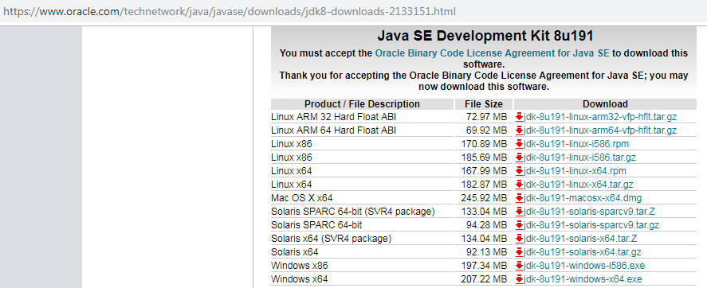

# Install Flutter di Windows Tanpa Android Studio

Untuk melakukan Instalasi <b>Flutter</b> pada Windows cukup mudah. Namun pastikan Windows Anda sudah memenuhi syarat. Berikut adalah beberapa rekomendasi yang dibutuhkan.

1. Microsoft Windows 7 SP1 atau diatasnya, direkomendasikan <b>Windows 10</b>.
2. Disk Spcae <b>400MB</b>.
3. <b>Windows PowerShell 5.0</b> atau diatasnya (Sudah include di Windows 10).
4. Jika Anda menggunakan Windows 7 atau Windows 8, Anda harus menginstall Windows PowerShell terlebih dahulu, silahkan mengikuti artikel di halaman <a href="https://docs.microsoft.com/en-us/skypeforbusiness/set-up-your-computer-for-windows-powershell/download-and-install-windows-powershell-5-1"> Doc Microsoft </a>.
5. <b> Git </b> untuk Windows versi 2.0 atau diatasnya.

## Install JDK
Cek apakah ada JDK/JRE sudah terinstall sebelumnya (atau bawaan mesin). Uninstall agar bersih via: <b> Control Panel > Programs > Programs and Features </b>.

Download JDK 11.* terbaru ( saya lebih prefer versi stabil 8.* ) di <a href="https://www.oracle.com/technetwork/java/javase/downloads/index.html"> https://www.oracle.com/technetwork/java/javase/downloads/index.html </a>

Klik file installer yang sudah di donwload. Di wizard instalasi jangan lupa sempatkan catat/copy instalasi kita, contoh <code>C:\Program Files\Java\jdk1.8.0_191\ </code>(yang nanti akan menjadi JAVA_HOME)

Setelah terinstall, buka : <code>Control Panel > System and Security > System > Advanced System Setting</code> lalu pilih <b> Tab Advanced </b> dan klik tombol <b> Environtment Variables </b>.

Cari bagian Path lalu edit atau tambahkan <code>C:\Program Files\Java\jdk.1.8.0_191\bin;</code> (dipaling depan saja), lalu klik OK.

Untuk memeriksa apakah path kita sudah siap dipalai, buka <b>Command Shell</b> dan cek versi Java menggunakan Command Line: <code>Java -version</code>

Kembali ke <b>Environment Variables</b>, gunakan tombol New dan buat variabel JAVA_HOME dengan isi Path JDK (tanpa bin).

